AI coding是大模型的重要应用领域。在claude 3.7发布后，cursor的编码能力又上了一个台阶。本文利用cursor claude 3.7 生成个人网页和deepseek智能助手。

# 一、环境搭建

## 1.1 cursor下载

首先从官网下载cursor

https://www.cursor.com/cn

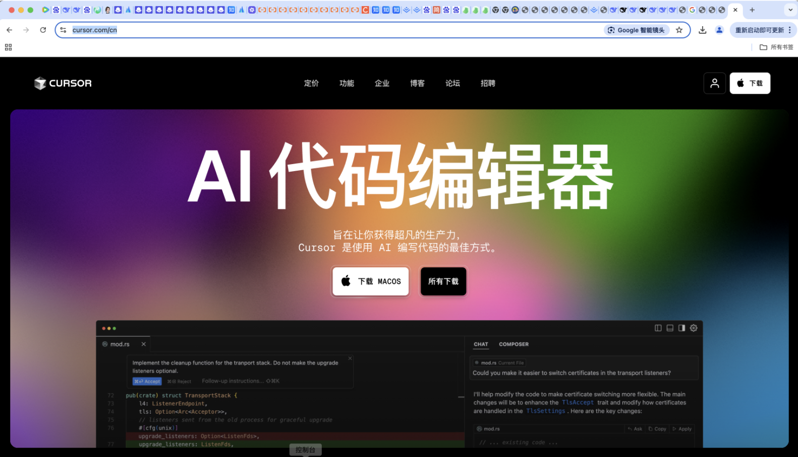

## 项目创建

打开一个空文件夹

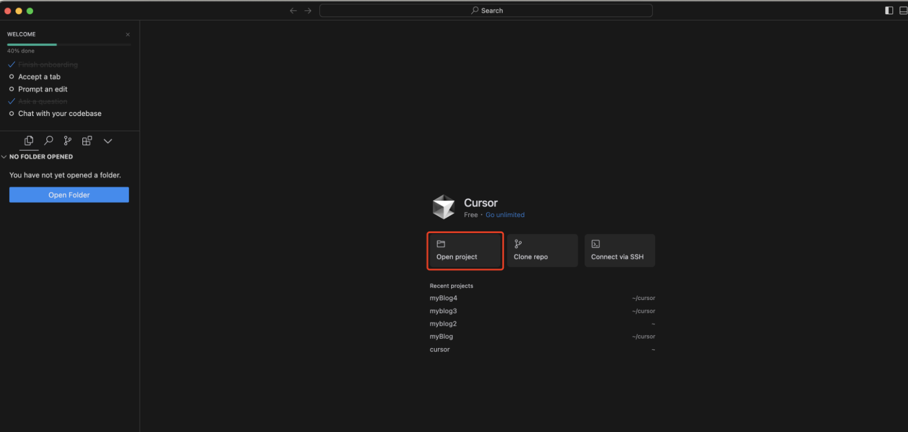

## 二、项目搭建

##2.1 打开cursor，让cursor帮你设计网页

**prompt**

```
我想设计一个个人网站。主要用于展示自己的几张照片，提供自己的社交链接，同时还要一个AI小助手，来回答用户问题。请先帮我设计下，用文字描述下页面，先不用写代码。
```

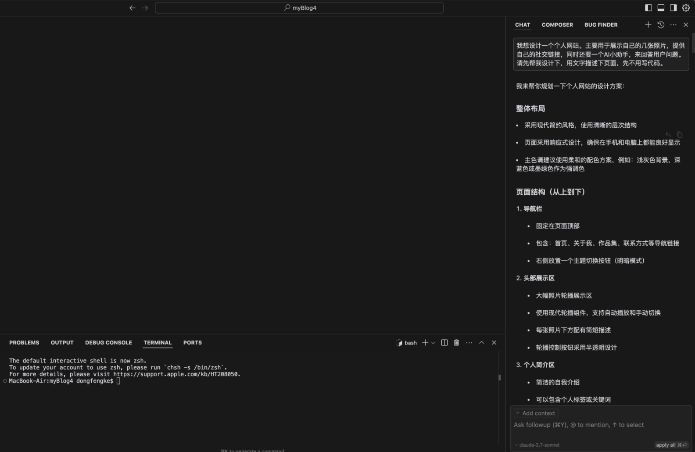

## 2.2 让cursor生成代码

**prompt**

```
不需要用很复杂的技术栈。帮我实现这个网页吧
```

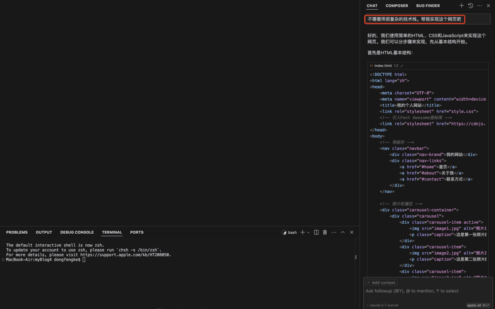

效果图如下：

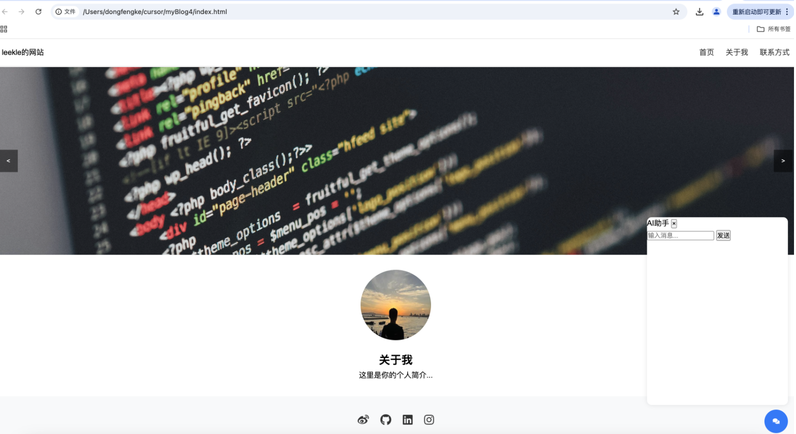

此时ai小助手的回复文案是固定的"我是AI助手，很高兴为您服务！"

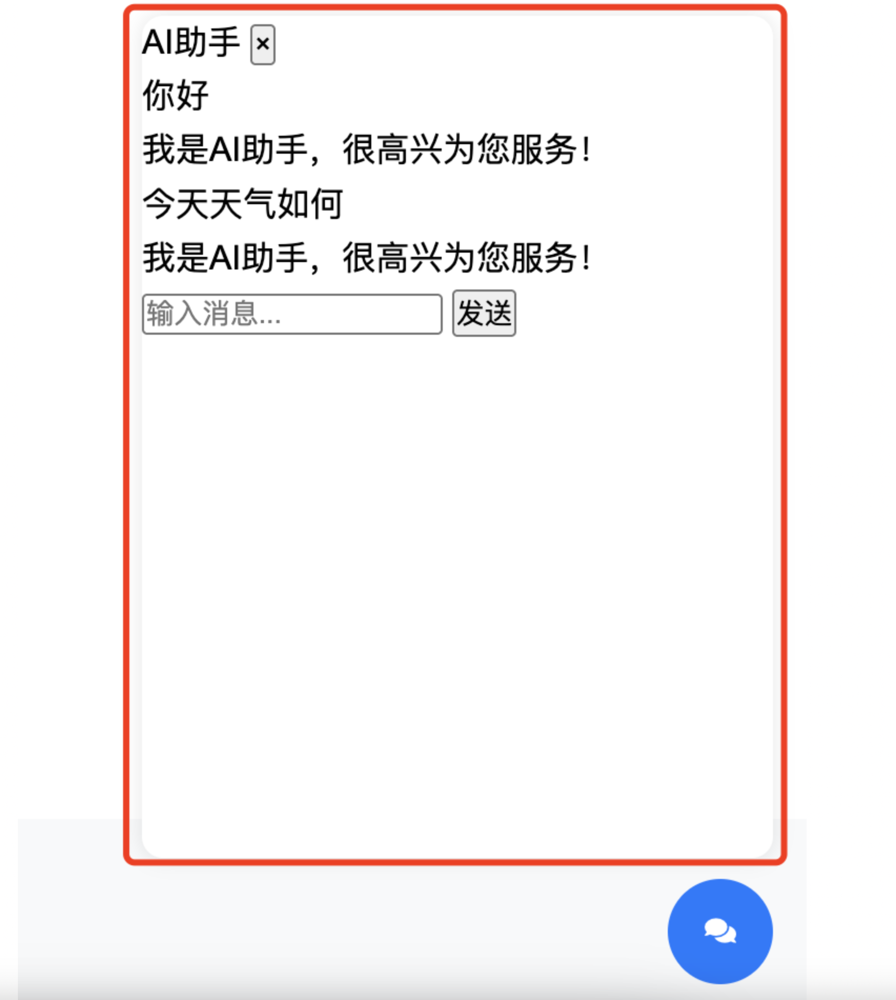

##2.3 接入deepseek

### 2.3.1 准备工作

进入deepseek开放平台创建api key

https://platform.deepseek.com/api_keys

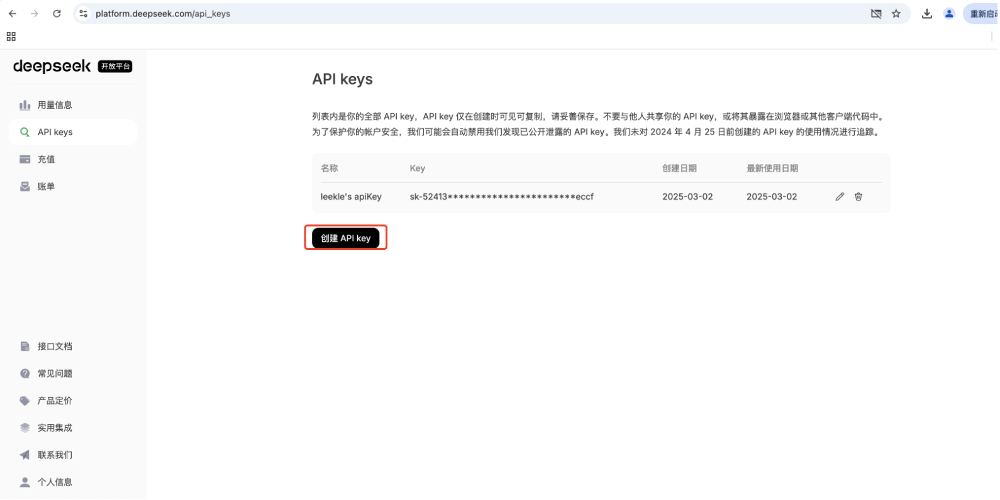

创建api key后，复制api key

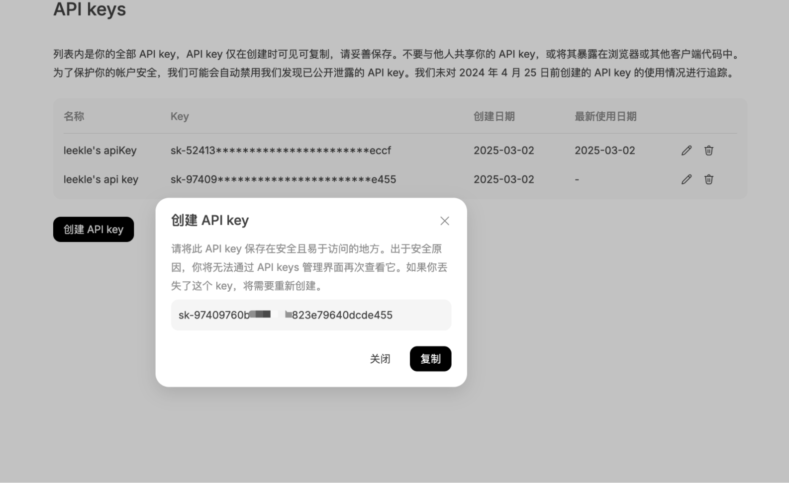

在deepseek账户中充值，充值1元即可进行测试

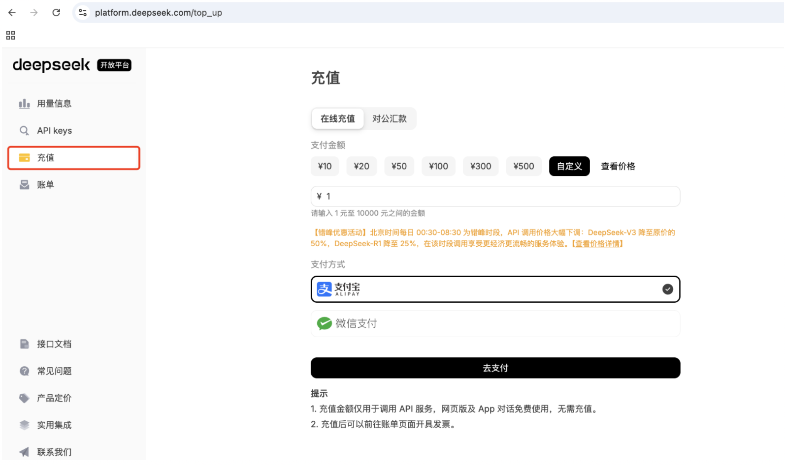

### 2.3.2 接入deepseek：

将deepseek的官方文档https://api-docs.deepseek.com/zh-cn/和你的api key告诉cursor，让cursor帮你对接deepseek api。

**prompt**

```
帮我接入一下 deepseek。
这是 deepseek的api文档: @https://api-docs.deepseek.com/zh-cn/  。这是我的api key： sk-97409***********************e455（这里填写你刚刚复制的api key）
```

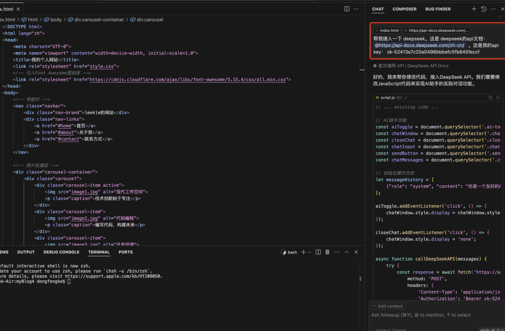

效果如下

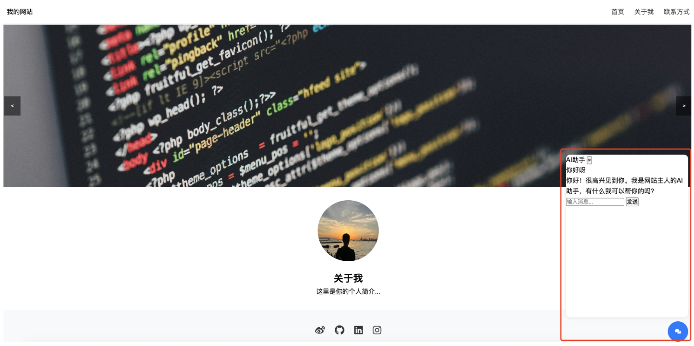


项目已经上传至github：https://github.com/Aikleke/person_webpage_with_cursor

